# Chocolatey Package for Log4cxx.

This package is beta quality and designed for a specific application.
At this time it is not recommended to distribute this package outside of the
tutorial application which requires it.

To build the package, follow these steps.

You need Git, Visual Studio 2017 Command line tools, CMake, Chocolatey, and a text editor.

## References

* Build steps and source patch based on https://github.com/aescande/log4cxxWin32
* [apr 1.5.2]http://archive.apache.org/dist/apr/apr-1.5.2-win32-src.zip)
* [apt-util 1.5.4](http://archive.apache.org/dist/apr/apr-util-1.5.4-win32-src.zip)
* [apache-log4cxx 0.10.0](https://archive.apache.org/dist/logging/log4cxx/0.10.0/apache-log4cxx-0.10.0.zip)

## Build Instructions

### Install Chocolatey
https://chocolatey.org/install

### Install Visual Studio 2017
https://visualstudio.microsoft.com/downloads/

Make sure you install the Windows SDK, this is an option you select when installing VisualStudio.

### Fetch code and apply patches
Open a Visual Studio Native Tools command prompt

```
cd choco-packages\package\log4cxx
call run.bat
```

Run `msys2` from a command prompt

* First install unzip tool (if you haven't before)
  * `pacman -S msys/unzip`
* Fetch and patch the code
  * `cd choco-packages/package/log4cxx`
  * `./tools/fetch_and_patch_source.sh`

### Open `ap/log4cxx/projects/log4cxx.dsw`

* Double click on `ap/log4cxx/projects/log4cxx.dsw` and choose Visual Studio 2017 as the application to open it
* When prompted for a "One-way upgrade", Click OK to continue

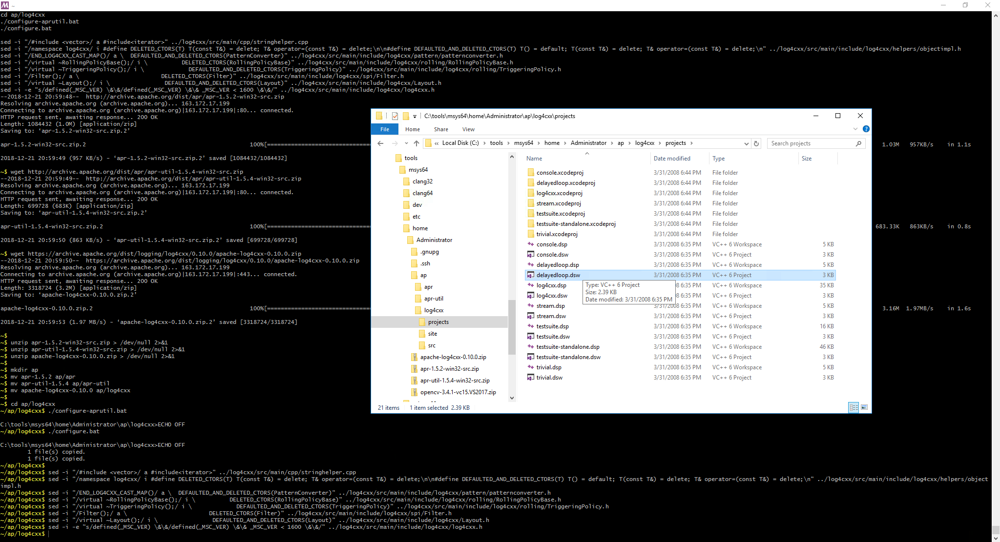
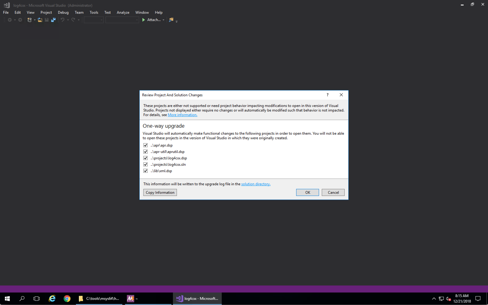
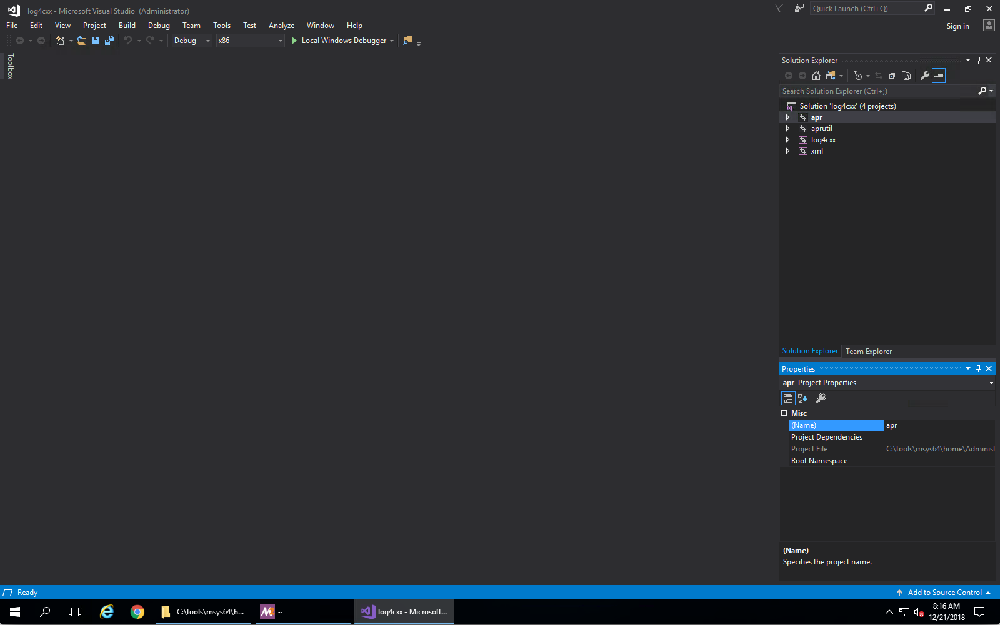


### Set the right platform

* Right-click "Solution 'log4cxx'" in the Solution Explorer panel on the right side, then click "Configuration Manager..."
* From the "Active Solution Platform" dropdown, choose the platform of choice. In the below images, we are using x64

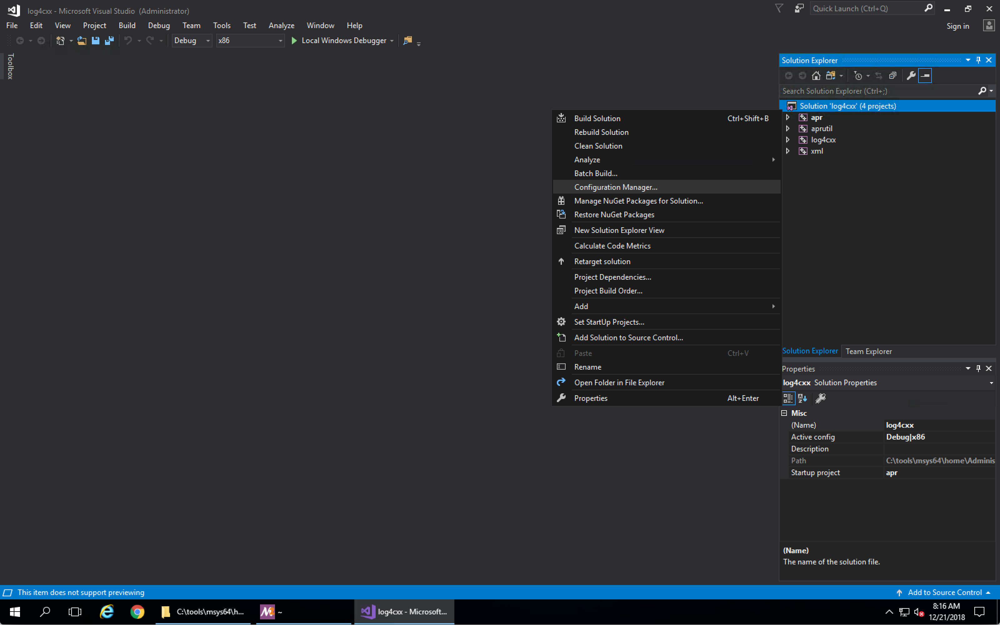
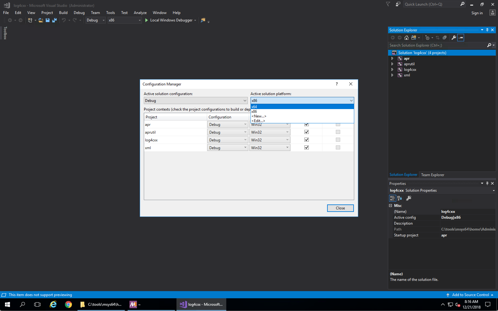
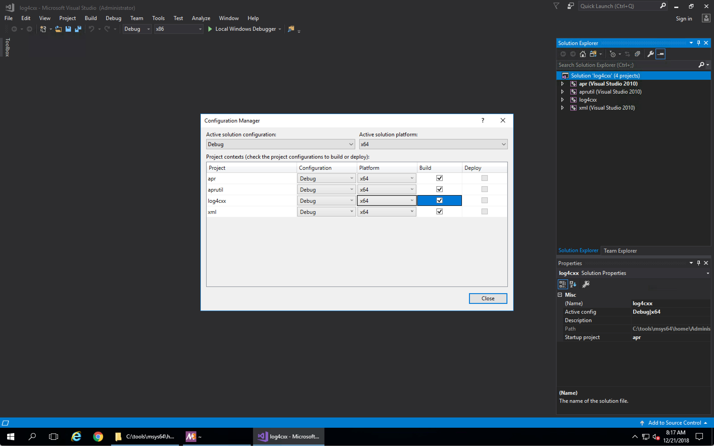

### Retarget solution

* Right-click solution again, then choose "Retarget solution..."
* In the dialog, select the correct `Windows SDK Version` and click `OK`.

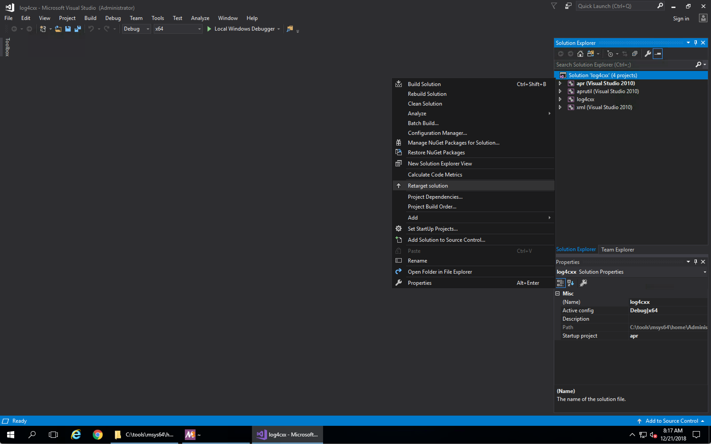
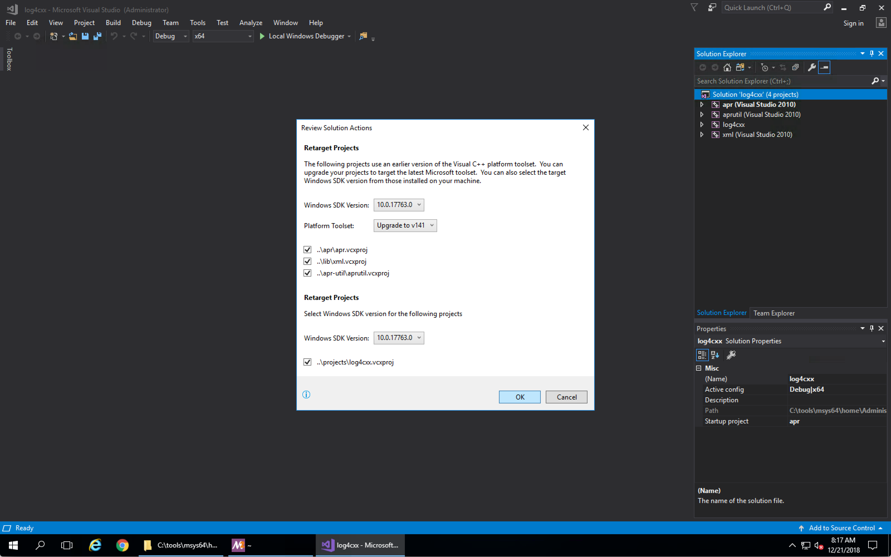
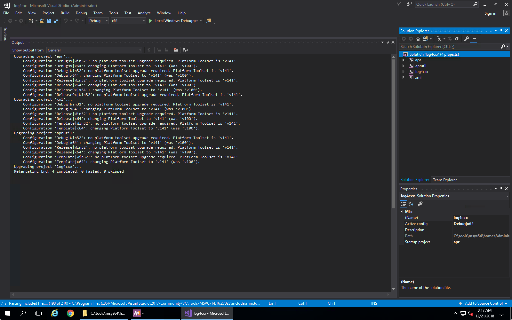

### rpcrt4 fix

To fix a potential build issue, add `rpcrt4.lib` as `Additional Dependency`.
* Right click project `log4cxx` and select "Properties" at the bottom
* `Configuration Properties > Linker > All Options > Additional Dependencies` - use the right side arrow to edit this property and add `rpcrt4.lib` to the list
* Press "Apply" on the properties editor to finish

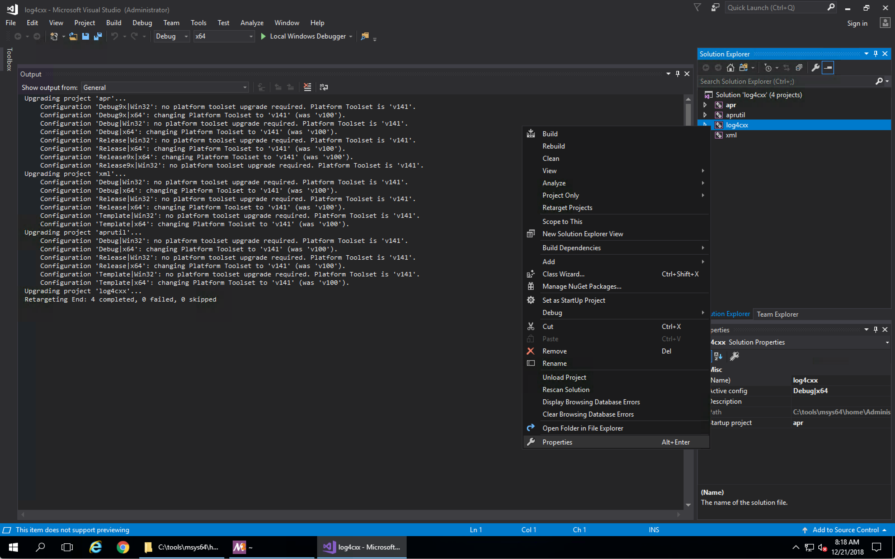
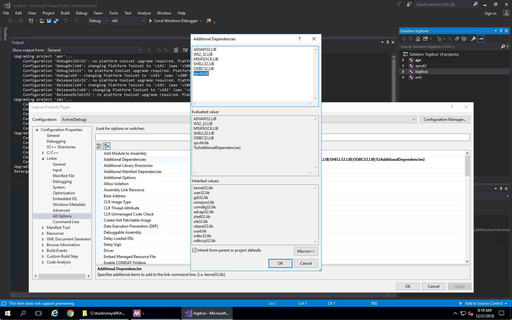

### Build

Right-click the `log4cxx` project in the Solution Explorer, and choose "Build"

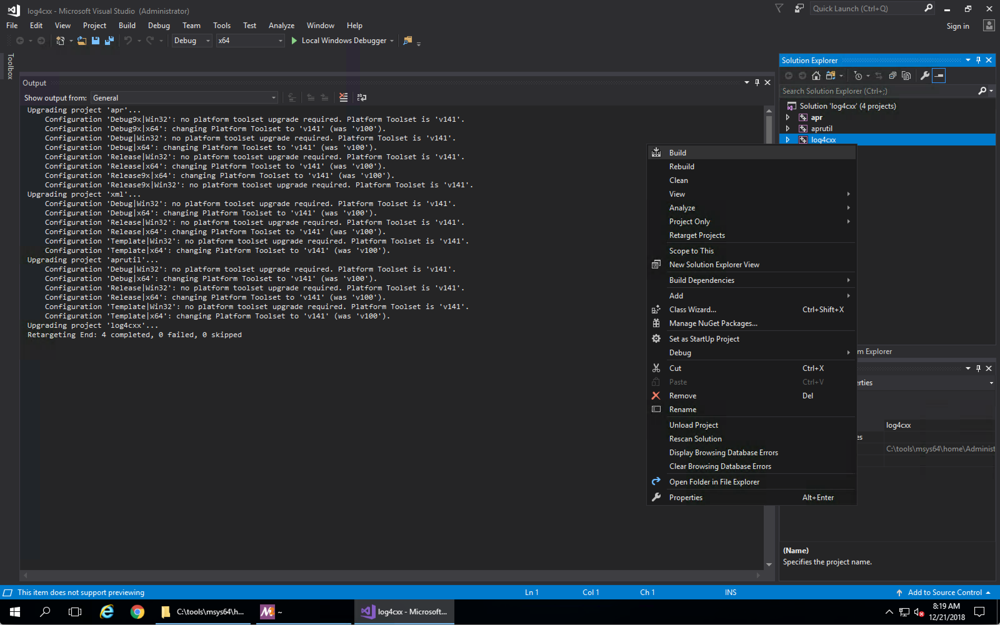
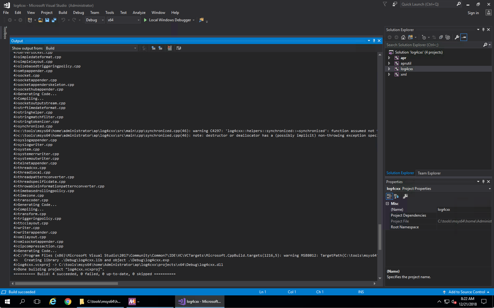

### Create Nupack

- Copy log4cxxd.lib and log4cxx.dll to the package lib/ directory.
- Find the debug symbols (a .pdb file) in the build directory and copy it to the package lib/ directory. I have to use File Explorer's search to find it.
- Copy *.h from the log4cxx source directory to the package include/ directory.
- Verify the information in the package share/cmake/ directory and nuspec.
- Run `choco pack`.
- Test the package and if it's good upload it somewhere your end users can reach it.

